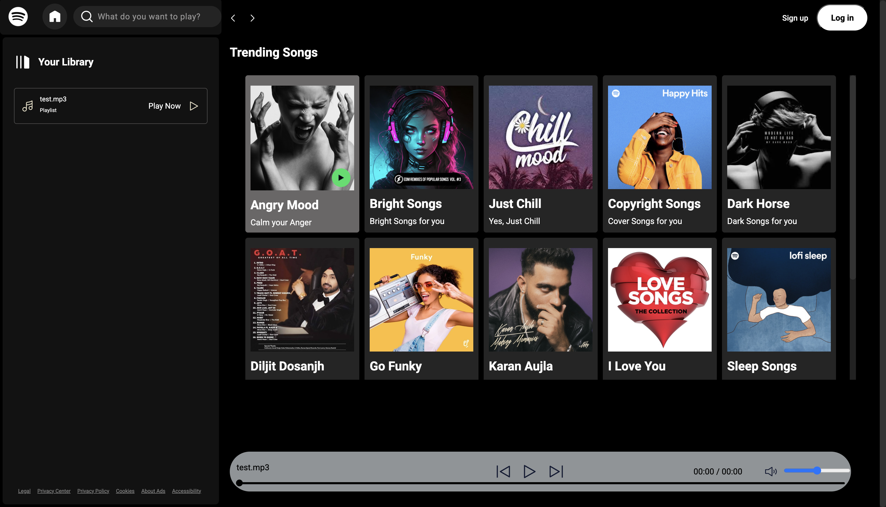

# 🎧 Spotify UI Clone

A polished and responsive frontend clone of Spotify's user interface, built using **HTML5**, **CSS3**, and **JavaScript**. This project mimics Spotify’s layout and design elements, focusing on aesthetic fidelity, user interaction, and clean structure, without backend or streaming integration.

---

## 📌 Project Overview

It recreates the look and feel of Spotify with an emphasis on design, accessibility, and responsiveness. The project includes sidebar navigation, song list display, search UI, and interactive buttons—designed to deliver a seamless user experience across devices.

---

## 🖼️ Preview

---

## ✨ Key Features

- ✅ Responsive sidebar with navigation icons (Home, Search, Library)
- ✅ Search bar with icon and blur/tab UI
- ✅ Custom icons with circular backgrounds
- ✅ Song list area ready for dynamic integration
- ✅ Clean layout using Flexbox and utility classes
- ✅ Hover animations for buttons and icons
- ✅ Blurred background effects using `backdrop-filter`
- ✅ Dark mode-friendly colors and contrast

---

## 🛠️ Tech Stack

| Technology   | Purpose                         |
|--------------|----------------------------------|
| HTML5        | Page structure & semantics       |
| CSS3         | Styling, layout, animations      |
| JavaScript   | DOM interaction and logic        |
| SVG/PNG      | Iconography                      |
| Flexbox/Grid | Layout system                    |

---

## 📂 Project Structure

spotify-clone/       
├── index.html # Main entry point         
├── style.css # Custom styles and responsiveness        
├── script.js # JavaScript interactivity      
├── img/ # Icons and media assets       
│ ├── logo.png      
│ ├── home.svg         
│ ├── search.svg        
│ ├── playlist.svg         
│ └── close.svg        

---

🎯 Future Enhancements         
             
🎵 Integrate real audio playback (using <audio> tag or Web Audio API)            
🔗 Connect to Spotify API for real-time data         
🧠 Add dynamic playlists and recently played sections     
🌓 Add full dark/light mode toggle    
   
---

## Author

**Mahek Agrawal**     
👩🏻‍💻Computer Engineer                  
GitHub: https://github.com/mahekagrawal16                
LinkedIn: https://linkedin.com/in/mahek-agrawal-503819255          
Email: mahek.suresh.aug2004@gmail.com  
